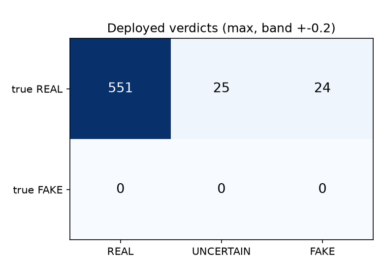
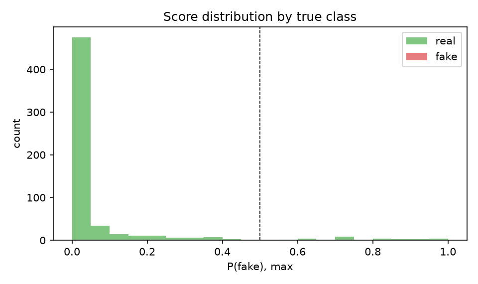
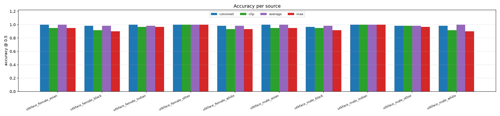

# TruthLens image evaluation

- Predictions: `pred_fairness.csv`  |  files: **600** (600 real, 0 fake)  |  sources: 10
- Decision threshold: **0.5**  |  deployed system: **max**  |  UNCERTAIN band: +-0.2
- Labels: 0 = real, 1 = fake. All numbers computed from stored model scores (`run_predictions.py`) using the exact production pipeline classes.

## Overall (all sources pooled)

| system | n | accuracy | balanced acc | fake recall | real specificity | precision | F1 | AUC | AP |
|---|---|---|---|---|---|---|---|---|---|
| convnext | 600 | 99.0% | 99.0% | n/a | 99.0% | 0.0% | n/a | n/a | n/a |
| clip | 600 | 95.7% | 95.7% | n/a | 95.7% | 0.0% | n/a | n/a | n/a |
| average | 600 | 99.2% | 99.2% | n/a | 99.2% | 0.0% | n/a | n/a | n/a |
| **max** | 600 | 94.8% | 94.8% | n/a | 94.8% | 0.0% | n/a | n/a | n/a |

_Only one class present in these predictions, so AUC/precision/calibration are undefined; accuracy here is recall on that class._

## Per source

| source | trained on? | real | fake | convnext acc | clip acc | average acc | max acc |
|---|---|---|---|---|---|---|---|
| utkface_female_asian | no | 60 | 0 | 100.0% | 95.0% | 100.0% | 95.0% |
| utkface_female_black | no | 60 | 0 | 98.3% | 91.7% | 98.3% | 90.0% |
| utkface_female_indian | no | 60 | 0 | 100.0% | 96.7% | 98.3% | 96.7% |
| utkface_female_other | no | 60 | 0 | 100.0% | 100.0% | 100.0% | 100.0% |
| utkface_female_white | no | 60 | 0 | 98.3% | 93.3% | 98.3% | 93.3% |
| utkface_male_asian | no | 60 | 0 | 100.0% | 95.0% | 100.0% | 95.0% |
| utkface_male_black | no | 60 | 0 | 96.7% | 95.0% | 98.3% | 91.7% |
| utkface_male_indian | no | 60 | 0 | 100.0% | 100.0% | 100.0% | 100.0% |
| utkface_male_other | no | 60 | 0 | 98.3% | 98.3% | 98.3% | 96.7% |
| utkface_male_white | no | 60 | 0 | 98.3% | 91.7% | 100.0% | 90.0% |

`trained on?` records whether the deployed model saw that source in training. `yes` sources measure fit, not generalisation; only `no` sources are honest held-out tests. Fake-only or real-only sources report recall on that single class.

## Figures

*Verdict confusion matrix for the deployed system, including the UNCERTAIN band (0.30-0.70).*

*How separated the deployed system's scores are for real vs fake.*

*Accuracy per data source and system.*

## Ablation: single models vs ensemble rules

`convnext` and `clip` are the two sub-models alone; `average` and `max` are the two combination rules. Production uses `max` (see CLAUDE.md section 3 for why). The table above is the ablation.
