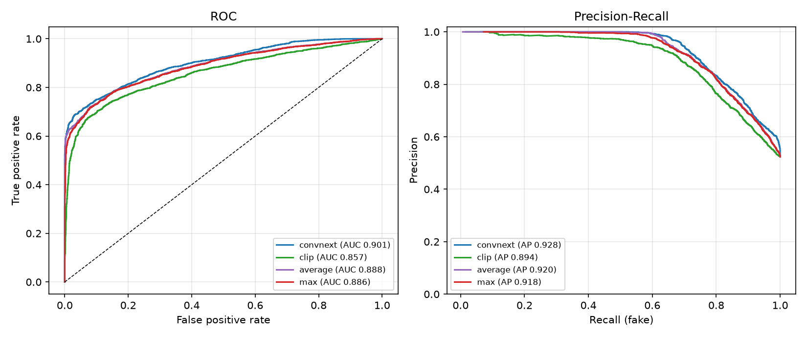
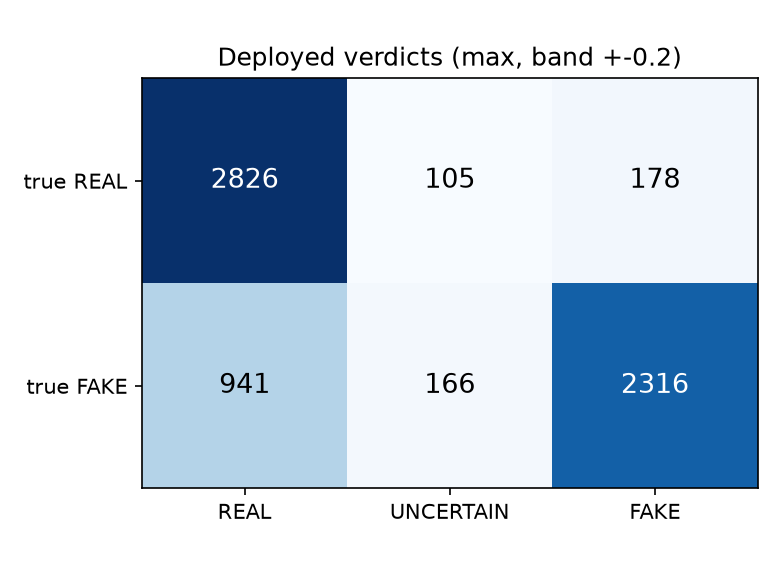
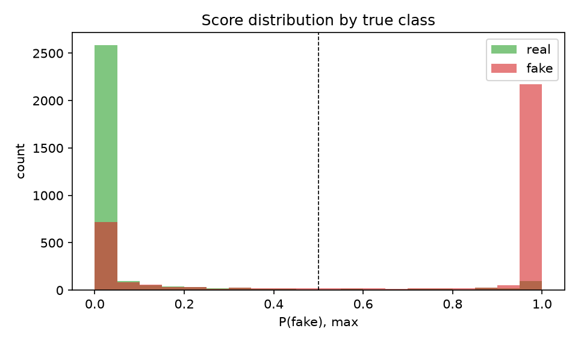
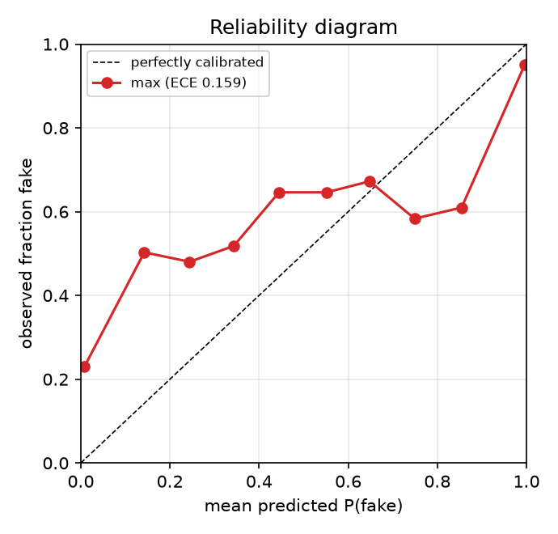
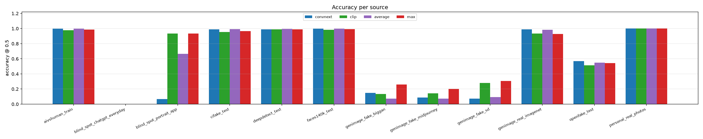
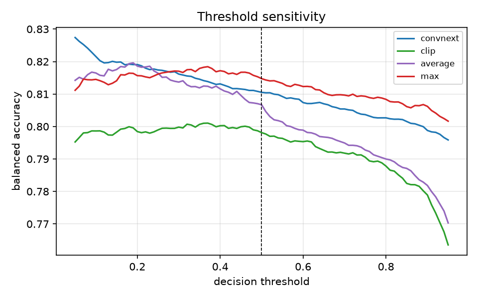

# TruthLens image evaluation

- Predictions: `pred_image.csv, pred_b1.csv, pred_b2.csv, pred_b3.csv, pred_b4.csv`  |  files: **6532** (3109 real, 3423 fake)  |  sources: 12
- Decision threshold: **0.5**  |  deployed system: **max**  |  UNCERTAIN band: +-0.2
- Labels: 0 = real, 1 = fake. All numbers computed from stored model scores (`run_predictions.py`) using the exact production pipeline classes.

## Overall (all sources pooled)

| system | n | accuracy | balanced acc | fake recall | real specificity | precision | F1 | AUC | AP |
|---|---|---|---|---|---|---|---|---|---|
| convnext | 6532 | 80.2% | 81.1% | 63.1% | 99.0% | 98.6% | 0.770 | 0.901 [0.894, 0.909] | 0.928 |
| clip | 6532 | 79.1% | 79.8% | 66.0% | 93.6% | 91.9% | 0.768 | 0.857 [0.848, 0.866] | 0.894 |
| average | 6532 | 79.8% | 80.7% | 63.0% | 98.3% | 97.6% | 0.766 | 0.888 [0.880, 0.896] | 0.920 |
| **max** | 6532 | 80.9% | 81.5% | 70.0% | 92.9% | 91.6% | 0.794 | 0.886 [0.878, 0.894] | 0.918 |

AUC brackets are 95% bootstrap confidence intervals (1000 resamples).

Calibration of the deployed system: ECE = **0.159** (10 bins; lower is better).

## By training status (the honest comparison)

`yes` = the model saw this data source in training (measures fit). `no` = never seen (measures generalisation). Pooled numbers above mix the two and depend on how many files of each were sampled, so read this table instead.

| training status | system | files | real | fake | accuracy | balanced acc | fake recall | real specificity | AUC |
|---|---|---|---|---|---|---|---|---|---|
| clip_only | convnext | 15 | 0 | 15 | 6.7% | 6.7% | 6.7% | n/a | n/a |
| clip_only | clip | 15 | 0 | 15 | 93.3% | 93.3% | 93.3% | n/a | n/a |
| clip_only | average | 15 | 0 | 15 | 66.7% | 66.7% | 66.7% | n/a | n/a |
| clip_only | **max** | 15 | 0 | 15 | 93.3% | 93.3% | 93.3% | n/a | n/a |
| no | convnext | 2517 | 1109 | 1408 | 50.2% | 55.4% | 12.0% | 98.7% | 0.665 |
| no | clip | 2517 | 1109 | 1408 | 49.7% | 53.6% | 20.6% | 86.7% | 0.640 |
| no | average | 2517 | 1109 | 1408 | 48.5% | 53.6% | 10.9% | 96.3% | 0.670 |
| no | **max** | 2517 | 1109 | 1408 | 53.2% | 56.6% | 27.3% | 86.0% | 0.665 |
| yes | convnext | 4000 | 2000 | 2000 | 99.3% | 99.3% | 99.5% | 99.2% | 1.000 |
| yes | clip | 4000 | 2000 | 2000 | 97.6% | 97.6% | 97.8% | 97.5% | 0.997 |
| yes | average | 4000 | 2000 | 2000 | 99.6% | 99.6% | 99.8% | 99.4% | 1.000 |
| yes | **max** | 4000 | 2000 | 2000 | 98.4% | 98.4% | 100.0% | 96.8% | 1.000 |

## Per source

| source | trained on? | real | fake | convnext acc | clip acc | average acc | max acc |
|---|---|---|---|---|---|---|---|
| aivshuman_train | yes | 500 | 500 | 99.8% | 97.8% | 99.8% | 98.7% |
| blind_spot_chatgpt_everyday | no | 0 | 8 | 0.0% | 0.0% | 0.0% | 0.0% |
| blind_spot_portrait_app | clip_only | 0 | 15 | 6.7% | 93.3% | 66.7% | 93.3% |
| cifake_test | yes | 500 | 500 | 98.8% | 95.5% | 99.2% | 96.6% |
| deepdetect_test | yes | 500 | 500 | 98.8% | 98.8% | 99.4% | 99.0% |
| faces140k_test | yes | 500 | 500 | 99.9% | 98.4% | 99.9% | 99.1% |
| genimage_fake_biggan | no | 0 | 300 | 15.0% | 13.3% | 7.3% | 26.0% |
| genimage_fake_midjourney | no | 0 | 300 | 8.7% | 14.3% | 7.3% | 20.0% |
| genimage_fake_sd | no | 0 | 300 | 7.3% | 28.0% | 9.3% | 30.7% |
| genimage_real_imagenet | no | 600 | 0 | 98.8% | 93.5% | 98.5% | 92.7% |
| openfake_test | no | 500 | 500 | 56.9% | 51.4% | 54.9% | 54.3% |
| personal_real_photos | no | 9 | 0 | 100.0% | 100.0% | 100.0% | 100.0% |

### Fake-only sources: AUC against ALL real images

Each fake-only source (typically one generator) is scored against every real image in the evaluation set, so a per-generator ranking quality is visible even though the source has no real images of its own.

| source (generator) | trained on? | fakes | convnext AUC | clip AUC | average AUC | max AUC |
|---|---|---|---|---|---|---|
| blind_spot_chatgpt_everyday | no | 8 | 0.295 | 0.294 | 0.207 | 0.201 |
| blind_spot_portrait_app | clip_only | 15 | 0.786 | 0.987 | 0.978 | 0.986 |
| genimage_fake_biggan | no | 300 | 0.780 | 0.735 | 0.774 | 0.769 |
| genimage_fake_midjourney | no | 300 | 0.778 | 0.576 | 0.682 | 0.679 |
| genimage_fake_sd | no | 300 | 0.709 | 0.734 | 0.738 | 0.733 |

`trained on?` records whether the deployed model saw that source in training. `yes` sources measure fit, not generalisation; only `no` sources are honest held-out tests. Fake-only or real-only sources report recall on that single class.

## Figures

*ROC and precision-recall curves, all sources pooled.*

*Verdict confusion matrix for the deployed system, including the UNCERTAIN band (0.30-0.70).*

*How separated the deployed system's scores are for real vs fake.*

*Calibration: does 90% confidence mean 90% correct? Points below the diagonal are over-confident.*

*Accuracy per data source and system.*

*Balanced accuracy as the decision threshold moves (dashed = deployed threshold). Descriptive only - no threshold is changed.*

## Ablation: single models vs ensemble rules

`convnext` and `clip` are the two sub-models alone; `average` and `max` are the two combination rules. Production uses `max` (see CLAUDE.md section 3 for why). The table above is the ablation.
