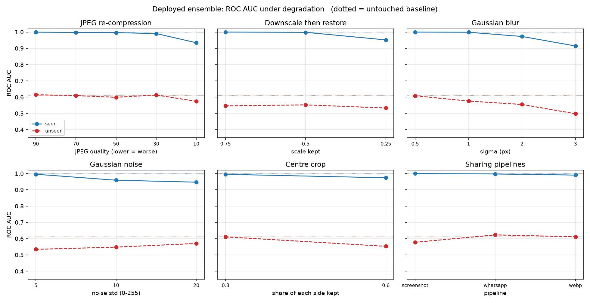
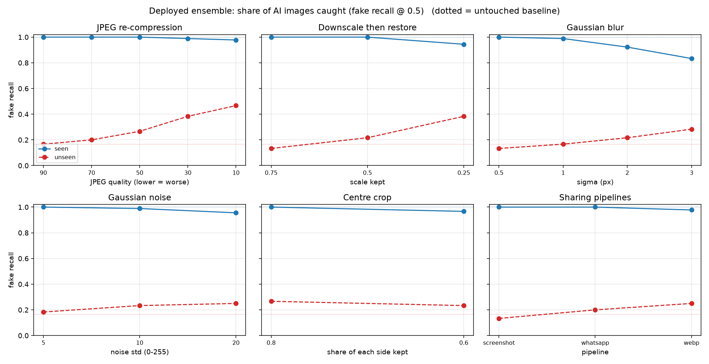
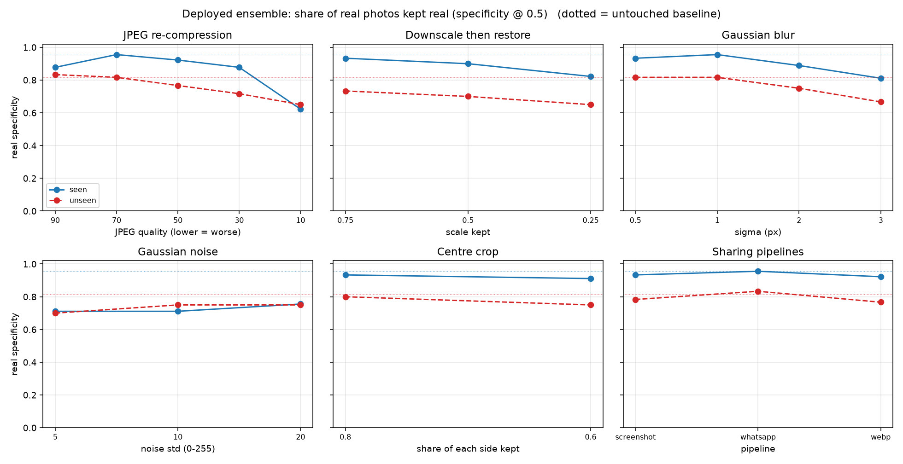
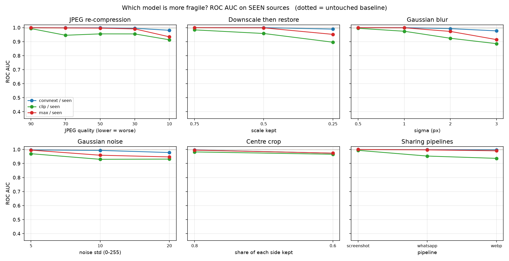
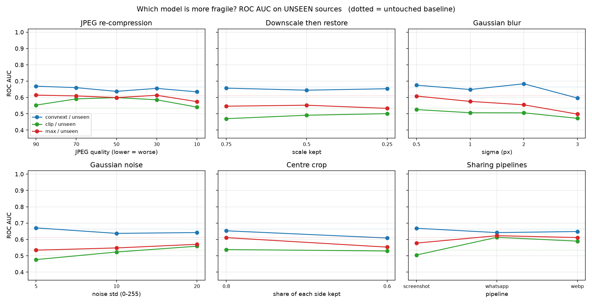
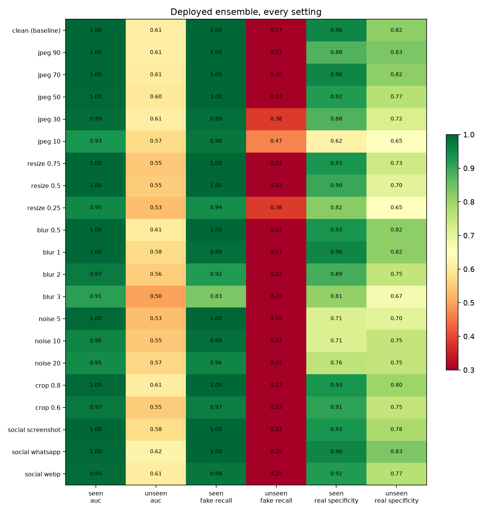

# Robustness of the deployed image detectors

- **300 images** (label-balanced; 3 seen sources = AI-vs-Human, 140k Faces, DeepDetect; 2 unseen = OpenFake, GenImage) x **21 settings**, scored by the production classes (`ImagePipeline`, `ClipPipeline`).
- **Deployed system** = max(ConvNeXt-Tiny, CLIP). Quality = ROC AUC (threshold-free) plus fake recall / real specificity at the deployed 0.5 threshold, which show *how* it fails.
- 95 % AUC intervals are bootstrap (300 resamples); with 90-120 images per group they are wide - read differences smaller than the interval as noise.
- Every degradation is deterministic (`eval/perturbations.py`); the untouched baseline reproduces the earlier evaluation exactly.

## Seen sources (trained on)

| setting | AUC (deployed) | Δ AUC | fake recall | real specificity | AUC convnext | AUC clip |
|---|---|---|---|---|---|---|
| clean (baseline) | 1.000 [1.000, 1.000] |  | 100.0% | 95.6% | 1.000 | 0.996 |
| jpeg 90 | 0.999 [0.997, 1.000] | -0.001 | 100.0% | 87.8% | 1.000 | 0.993 |
| jpeg 70 | 0.998 [0.993, 1.000] | -0.002 | 100.0% | 95.6% | 0.999 | 0.945 |
| jpeg 50 | 0.996 [0.990, 1.000] | -0.004 | 100.0% | 92.2% | 0.998 | 0.955 |
| jpeg 30 | 0.991 [0.979, 0.998] | -0.009 | 98.9% | 87.8% | 0.995 | 0.955 |
| jpeg 10 | 0.934 [0.904, 0.967] | -0.066 | 97.8% | 62.2% | 0.981 | 0.913 |
| resize 0.75 | 1.000 [0.998, 1.000] | -0.000 | 100.0% | 93.3% | 1.000 | 0.984 |
| resize 0.5 | 0.998 [0.994, 1.000] | -0.002 | 100.0% | 90.0% | 1.000 | 0.958 |
| resize 0.25 | 0.952 [0.921, 0.973] | -0.048 | 94.4% | 82.2% | 0.989 | 0.896 |
| blur 0.5 | 1.000 [0.998, 1.000] | -0.000 | 100.0% | 93.3% | 1.000 | 0.995 |
| blur 1 | 0.999 [0.995, 1.000] | -0.001 | 98.9% | 95.6% | 1.000 | 0.974 |
| blur 2 | 0.973 [0.951, 0.988] | -0.027 | 92.2% | 88.9% | 0.992 | 0.924 |
| blur 3 | 0.914 [0.870, 0.948] | -0.086 | 83.3% | 81.1% | 0.977 | 0.885 |
| noise 5 | 0.995 [0.989, 0.999] | -0.005 | 100.0% | 71.1% | 0.997 | 0.970 |
| noise 10 | 0.959 [0.930, 0.983] | -0.041 | 98.9% | 71.1% | 0.993 | 0.930 |
| noise 20 | 0.947 [0.913, 0.969] | -0.053 | 95.6% | 75.6% | 0.978 | 0.931 |
| crop 0.8 | 0.995 [0.987, 1.000] | -0.005 | 100.0% | 93.3% | 0.996 | 0.982 |
| crop 0.6 | 0.974 [0.941, 0.996] | -0.026 | 96.7% | 91.1% | 0.973 | 0.966 |
| social screenshot | 1.000 [0.999, 1.000] | -0.000 | 100.0% | 93.3% | 1.000 | 0.994 |
| social whatsapp | 0.997 [0.993, 1.000] | -0.003 | 100.0% | 95.6% | 0.998 | 0.953 |
| social webp | 0.990 [0.979, 0.999] | -0.010 | 97.8% | 92.2% | 0.998 | 0.937 |

## Unseen sources (never seen)

| setting | AUC (deployed) | Δ AUC | fake recall | real specificity | AUC convnext | AUC clip |
|---|---|---|---|---|---|---|
| clean (baseline) | 0.612 [0.512, 0.700] |  | 16.7% | 81.7% | 0.665 | 0.536 |
| jpeg 90 | 0.614 [0.524, 0.705] | +0.003 | 16.7% | 83.3% | 0.669 | 0.553 |
| jpeg 70 | 0.609 [0.510, 0.708] | -0.002 | 20.0% | 81.7% | 0.660 | 0.591 |
| jpeg 50 | 0.599 [0.502, 0.687] | -0.013 | 26.7% | 76.7% | 0.637 | 0.599 |
| jpeg 30 | 0.613 [0.513, 0.704] | +0.001 | 38.3% | 71.7% | 0.656 | 0.586 |
| jpeg 10 | 0.574 [0.478, 0.670] | -0.037 | 46.7% | 65.0% | 0.634 | 0.541 |
| resize 0.75 | 0.546 [0.443, 0.643] | -0.066 | 13.3% | 73.3% | 0.657 | 0.470 |
| resize 0.5 | 0.552 [0.451, 0.654] | -0.059 | 21.7% | 70.0% | 0.644 | 0.491 |
| resize 0.25 | 0.533 [0.428, 0.639] | -0.079 | 38.3% | 65.0% | 0.653 | 0.501 |
| blur 0.5 | 0.608 [0.502, 0.701] | -0.004 | 13.3% | 81.7% | 0.675 | 0.526 |
| blur 1 | 0.576 [0.470, 0.674] | -0.036 | 16.7% | 81.7% | 0.649 | 0.506 |
| blur 2 | 0.555 [0.447, 0.659] | -0.057 | 21.7% | 75.0% | 0.684 | 0.506 |
| blur 3 | 0.498 [0.388, 0.602] | -0.114 | 28.3% | 66.7% | 0.596 | 0.472 |
| noise 5 | 0.534 [0.421, 0.636] | -0.078 | 18.3% | 70.0% | 0.671 | 0.476 |
| noise 10 | 0.548 [0.432, 0.646] | -0.064 | 23.3% | 75.0% | 0.637 | 0.523 |
| noise 20 | 0.570 [0.472, 0.671] | -0.042 | 25.0% | 75.0% | 0.642 | 0.558 |
| crop 0.8 | 0.611 [0.505, 0.703] | -0.001 | 26.7% | 80.0% | 0.653 | 0.538 |
| crop 0.6 | 0.553 [0.445, 0.656] | -0.059 | 23.3% | 75.0% | 0.609 | 0.529 |
| social screenshot | 0.578 [0.474, 0.668] | -0.034 | 13.3% | 78.3% | 0.668 | 0.504 |
| social whatsapp | 0.623 [0.527, 0.711] | +0.011 | 20.0% | 83.3% | 0.642 | 0.613 |
| social webp | 0.611 [0.507, 0.718] | -0.001 | 25.0% | 76.7% | 0.648 | 0.589 |

## Most damaging degradations (deployed AUC drop vs clean)

| rank | setting | seen ΔAUC | unseen ΔAUC |
|---|---|---|---|
| 1 | blur 3 | -0.086 | -0.114 |
| 2 | resize 0.25 | -0.048 | -0.079 |
| 3 | noise 10 | -0.041 | -0.064 |
| 4 | jpeg 10 | -0.066 | -0.037 |
| 5 | noise 20 | -0.053 | -0.042 |
| 6 | crop 0.6 | -0.026 | -0.059 |
| 7 | blur 2 | -0.027 | -0.057 |
| 8 | noise 5 | -0.005 | -0.078 |

## Figures

*Deployed ROC AUC per degradation family (solid = seen, dashed = unseen, dotted = clean baseline).*

*Share of AI images caught: does degradation make the detector miss fakes?*

*Share of real photos kept real: does degradation make it cry wolf?*

*ConvNeXt vs CLIP vs the max ensemble on seen sources.*

*The same on unseen sources.*

*Every setting at a glance.*
