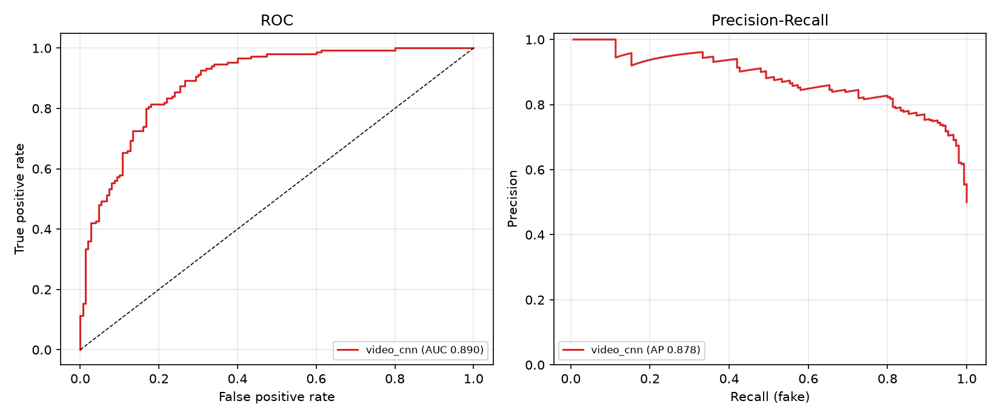
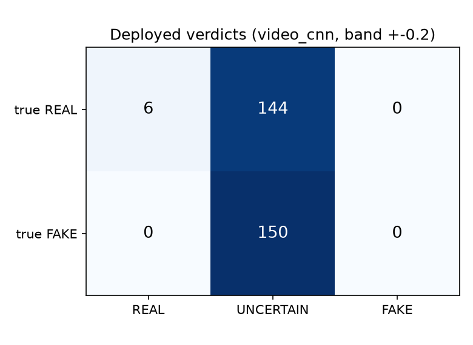
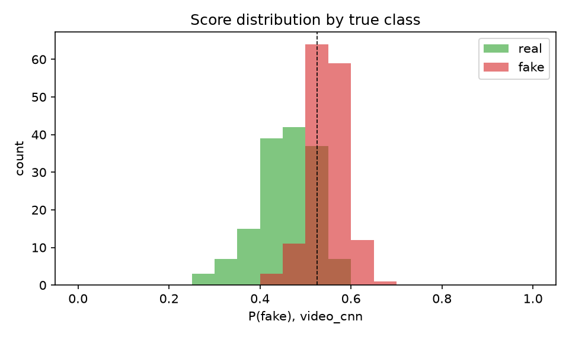
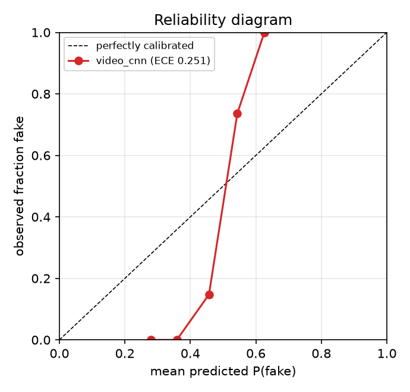
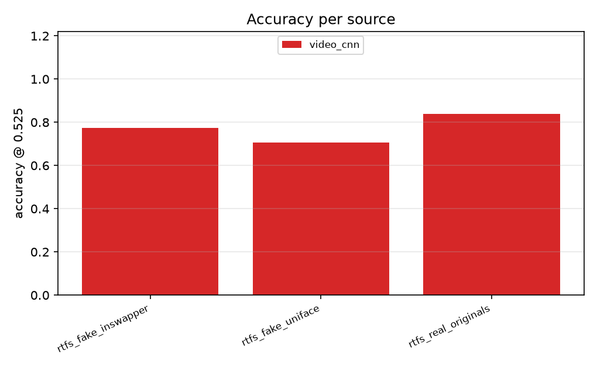
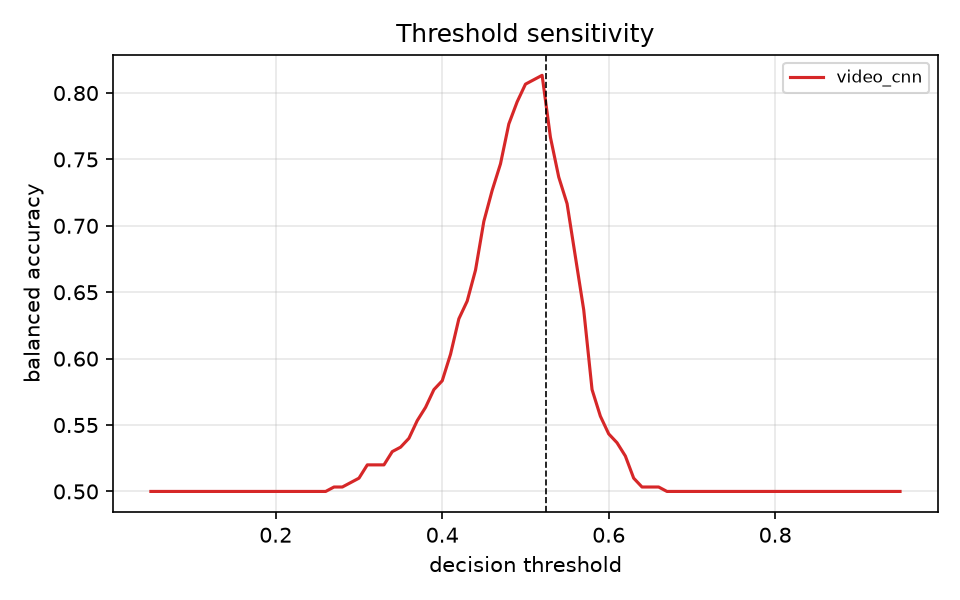

# TruthLens video evaluation

- Predictions: `pred_video_rtfs_consensus.csv`  |  files: **300** (150 real, 150 fake)  |  sources: 3
- Decision threshold: **0.525**  |  deployed system: **video_cnn**  |  UNCERTAIN band: +-0.2
- Labels: 0 = real, 1 = fake. All numbers computed from stored model scores (`run_predictions.py`) using the exact production pipeline classes.

## Overall (all sources pooled)

| system | n | accuracy | balanced acc | fake recall | real specificity | precision | F1 | AUC | AP |
|---|---|---|---|---|---|---|---|---|---|
| **video_cnn** | 300 | 79.0% | 79.0% | 74.0% | 84.0% | 82.2% | 0.779 | 0.890 [0.850, 0.921] | 0.878 |

AUC brackets are 95% bootstrap confidence intervals (1000 resamples).

Calibration of the deployed system: ECE = **0.251** (10 bins; lower is better).

## Per source

| source | trained on? | real | fake | video_cnn acc |
|---|---|---|---|---|
| rtfs_fake_inswapper | no | 0 | 75 | 77.3% |
| rtfs_fake_uniface | no | 0 | 75 | 70.7% |
| rtfs_real_originals | no | 150 | 0 | 84.0% |

### Fake-only sources: AUC against ALL real images

Each fake-only source (typically one generator) is scored against every real image in the evaluation set, so a per-generator ranking quality is visible even though the source has no real images of its own.

| source (generator) | trained on? | fakes | video_cnn AUC |
|---|---|---|---|
| rtfs_fake_inswapper | no | 75 | 0.911 |
| rtfs_fake_uniface | no | 75 | 0.869 |

`trained on?` records whether the deployed model saw that source in training. `yes` sources measure fit, not generalisation; only `no` sources are honest held-out tests. Fake-only or real-only sources report recall on that single class.

## Figures

*ROC and precision-recall curves, all sources pooled.*

*Verdict confusion matrix for the deployed system, including the UNCERTAIN band (0.33-0.73).*

*How separated the deployed system's scores are for real vs fake.*

*Calibration: does 90% confidence mean 90% correct? Points below the diagonal are over-confident.*

*Accuracy per data source and system.*

*Balanced accuracy as the decision threshold moves (dashed = deployed threshold). Descriptive only - no threshold is changed.*
