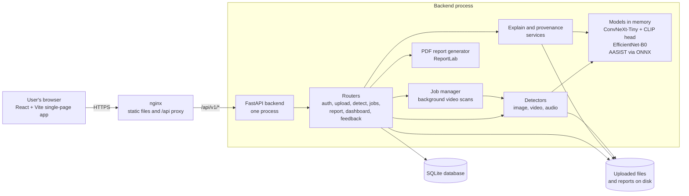
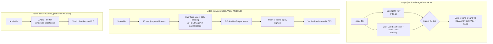
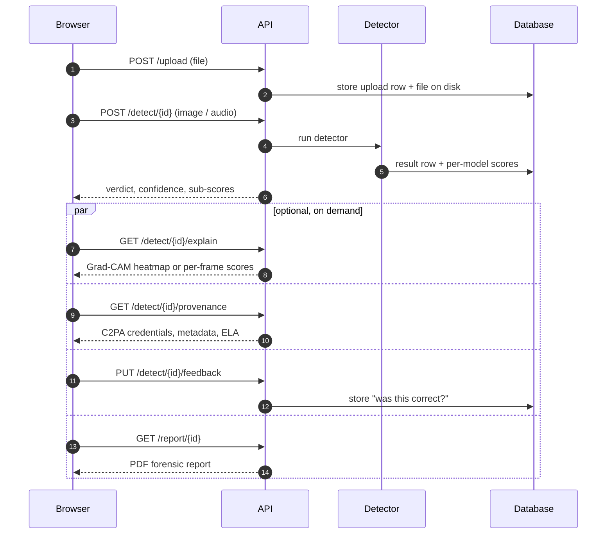
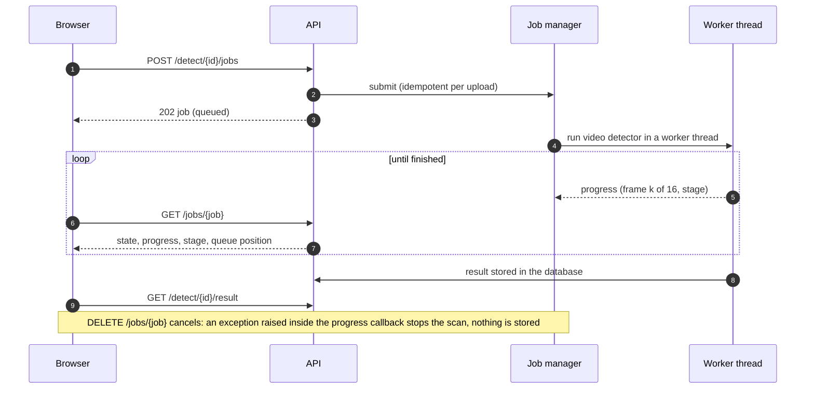
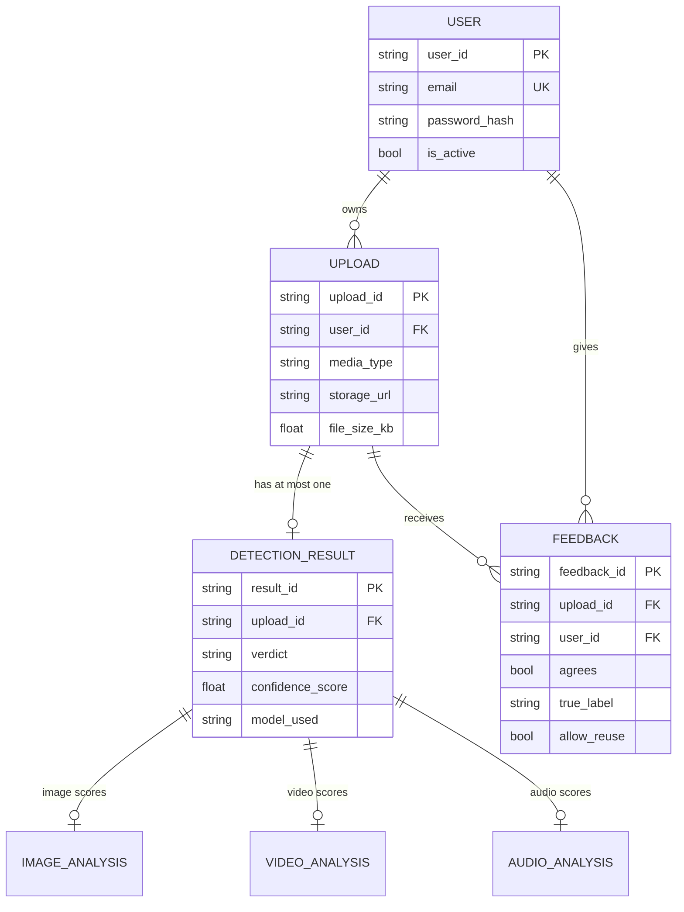

# TruthLens — architecture

How the system is put together, how a scan flows through it, and where each guarantee is enforced. Diagrams are
[Mermaid](https://mermaid.js.org/) (rendered by GitHub). For the authoritative list of what is real ML vs heuristic vs dead code,
see [`CLAUDE.md`](../CLAUDE.md); numbers on how well it works are in [`ETHICS_AND_LIMITATIONS.md`](ETHICS_AND_LIMITATIONS.md).

## 1. System overview

* **One backend process on purpose.** Background-job progress lives in that process's memory (results are durable in the
  database). See [DEPLOYMENT.md](DEPLOYMENT.md).
* **Models are loaded once** per process (first request pays the load) and shared by the detectors and the explainers.
* **Everything is per-user.** Every route that touches an upload, result, job, explanation, provenance or feedback checks
  ownership and answers **404 (not 403)** for someone else's data, so an id never reveals that it exists.

## 2. The three detectors

* Image uses **max**, not average: it lets either model's "fake" through, which recovers the portrait-app genre CLIP learned, at
  a small cost in false alarms on ordinary photos (measured, see the evaluation summary).
* Video Model v1 is verified against the original evaluation script's frame selection, face crop and pooling; a regression
  script guards that parity. The old byte-entropy heuristic remains selectable (`VIDEO_MODEL_BACKEND=heuristic`).
* The **UNCERTAIN band** (±0.2 around the threshold) exists so a borderline score is never presented as a confident call.

## 3. A scan, end to end

`POST /detect/{id}` is **idempotent**: an upload has at most one result. (A repeated call once stored a second row and broke every
read endpoint for that upload; there is a regression test.)

### Video scans run as background jobs

* At most `DETECTION_JOB_CONCURRENCY` jobs run at once (default 1: inference is CPU-bound); others wait with a queue position.
* The scoring runs in a worker thread, so a long video **no longer freezes the server** for other users.
* Progress numbers are real (frames decoded / cropped), not a timer. The callbacks are observation-only: predictions are
  bit-identical with and without them (tested).

## 4. Evidence beyond the verdict

| Layer | What it adds | Never does |
|---|---|---|
| **Explainability** (`services/explain`) | Grad-CAM heatmap (image) or per-frame scores + the exact face crops (video) | Change a verdict; explain CLIP (no heatmap for it, and the UI says so) |
| **Provenance** (`services/provenance`) | C2PA Content Credentials (signature, unchanged-since-signing, trust), EXIF, embedded generation parameters, ELA visual aid | Treat missing metadata as evidence; alter a stored result |
| **Feedback** (`api/routes/feedback.py`) | Users say whether a verdict was right; opt-in to let the file be kept for evaluation | Keep a file without explicit consent |

Where provenance and the model disagree (models say REAL, the file declares itself AI-generated) all three surfaces — API, UI and
PDF — say so explicitly.

## 5. Data model

Feedback is unique per (upload, user). Background jobs are **not** in the database (in-memory, single process).

## 6. Code map

| Area | Where |
|---|---|
| API routes | `backend/app/api/routes/` (`auth`, `upload`, `detect`, `jobs`, `report`, `dashboard`, `feedback`) |
| Detectors | `backend/app/services/{image,video,audio}/detector.py`; video model in `services/video/model_v1/` |
| Model code | `backend/app/pipelines/{image,image_clip}/` |
| Explain / provenance | `backend/app/services/explain/`, `backend/app/services/provenance/` |
| Jobs | `backend/app/services/jobs.py` |
| PDF report | `backend/app/services/report/generator.py` |
| Evaluation harness | `backend/eval/` (metrics, robustness, provenance study, results) |
| Tests / CI | `backend/tests/`, `.github/workflows/ci.yml` |
| Frontend | `frontend/src/` (`App.jsx` routes, `components/UploadFlow.jsx` the scan flow) |
| Deployment | `docker-compose.yml` (dev), `docker-compose.prod.yml`, `backend/Dockerfile.prod`, `frontend/nginx.prod.conf` |
