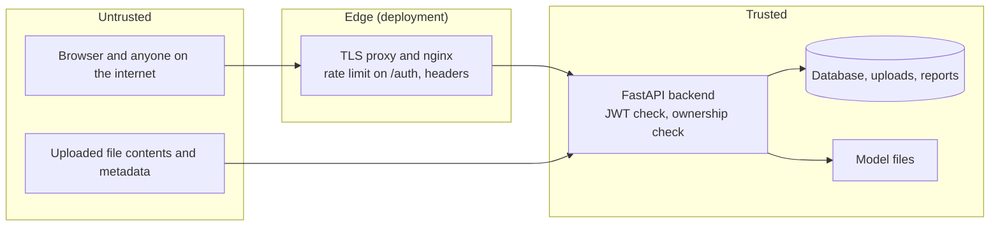

# TruthLens — threat model

What could go wrong, what already protects against it (and where that is tested), and what is **not** protected yet. Written from the
code as of 2026-09-27; every "mitigated" entry names the mechanism, and the gaps are listed as plainly as the defenses.

## 1. What we protect

| Asset | Why it matters |
|---|---|
| **Uploaded media** (photos, videos, audio) | Often personal; may show real people |
| **Accounts and login tokens** | Access to a user's history, files and reports |
| **Scan results, reports, feedback** | Private to each user; feedback may include notes |
| **Model files** (~335 MB) | Effort invested; tampering would silently change verdicts |
| **Verdict integrity** | Users act on it — a wrong "REAL" or "FAKE" can hurt someone |
| **Server resources** | CPU-bound inference is easy to exhaust |

## 2. Who might attack, and how

* **Another (curious or malicious) user** trying to read someone else's data.
* **An unauthenticated visitor** probing the API or guessing passwords.
* **A malicious file** aimed at the parsers that read uploads (image/video decoders, C2PA reader, PDF).
* **A forger** trying to make a fake pass as real (evasion) or a real file look fake (framing).
* **A resource abuser** filling the queue or the disk.

## 3. Trust boundaries

Everything that arrives over the network, **including the bytes and metadata inside an uploaded file**, is untrusted. Model files and
the database are trusted only because the server operator controls them.

## 4. Threats, defenses and gaps (STRIDE-style)

### Spoofing — pretending to be someone else

| Threat | Defense in place | Tested | Gap |
|---|---|---|---|
| Forge a login token | HS256 JWT signed with `AUTH_SECRET_KEY`; the server **refuses to start** with DEBUG off and an unset/default/short key | `test_auth`, `test_deploy_helpers` | The dev default key is public; dev mode (DEBUG on) does not enforce |
| Tampered / expired / wrong-key token | Signature and expiry verified (24 h) | `test_auth` | Tokens cannot be revoked before expiry |
| Guess passwords | bcrypt hashing; min 8 characters; identical error for unknown user and wrong password (no user enumeration); **nginx rate limit** on `/api/v1/auth/` (10/min per IP) | `test_auth` (app), config test (nginx) | No rate limit **inside the app** — running without the provided nginx has none; nginx config is only statically checked, never run here |
| Steal a token from the browser | Token lives in `localStorage` | — | **XSS would expose it** (a cookie-based `HttpOnly` design would not). No Content-Security-Policy is set yet |

### Tampering

| Threat | Defense | Tested | Gap |
|---|---|---|---|
| Read/change/delete **another user's** data by guessing an id | Every route checks ownership and answers **404 not 403**; ids are random UUIDs | `test_upload_and_access` (all owned routes), `test_jobs`, `test_feedback` | — |
| Path traversal via the upload filename | Files are stored under a generated UUID name; the client name is never used as a path | `test_upload_and_access` | — |
| Swap the model file to change verdicts | Read-only mounts in production compose; `fetch_checkpoints.py` verifies SHA-256 and discards mismatches | `test_deploy_helpers` | Nothing verifies the checksum **at start-up** if someone edits the mounted file later |
| Modify a C2PA-signed image after signing and keep the AI declaration | Content hash checked: a flipped byte is reported as "modified after signing" | `test_provenance` | Credentials can simply be **stripped** (see limitations) |

### Repudiation

* Scan results are stored with timestamps and the model used. There is **no audit log** of logins or deletions.

### Information disclosure

| Threat | Defense | Gap |
|---|---|---|
| Errors leaking internals (paths, stack traces) | Detection errors are mapped to fixed safe messages; unexpected errors give a generic 500 | The **global** exception handler in `main.py` returns `str(exc)` in its 500 body — could echo an internal message for an unforeseen failure |
| GPS location inside a photo | Provenance reports only that GPS **exists**; coordinates are never returned | The file itself is stored unmodified on disk |
| Reusing uploads without consent | Feedback `allow_reuse` defaults to **off**; the export tool copies files and comments **only** for consenting users | `test_feedback` covers this |
| Data retention | — | **Uploads and reports are kept indefinitely**; there is no retention period or delete-my-data endpoint (feedback can be withdrawn; the upload cannot) |
| CORS | Configurable (`CORS_ORIGINS`); startup warns when it is `*` in production | Default stays `*` for development |

### Denial of service

| Threat | Defense | Gap |
|---|---|---|
| Huge upload | 100 MB cap (`MAX_FILE_SIZE_MB`), also `client_max_body_size` in nginx | The file is read fully into memory before the size check |
| Flood the scan queue | One job runs at a time; duplicates for one upload are merged | The **queue length and per-user job count are unlimited**; there are no per-user storage quotas |
| Slow scans blocking everyone | Video scoring runs in a worker thread; a running scan does not block other requests | Image/audio detectors are still blocking calls inside the event loop |
| Image "decompression bombs" | Relies on Pillow's default pixel limit | Not separately tested |
| Single-process design | Simple and predictable | One crash loses in-flight job state (results already stored are safe) |

### Elevation of privilege / hostile files

| Threat | Defense | Gap |
|---|---|---|
| Executable or script disguised as an image | Files are never executed or served back inline; only decoded by Pillow/OpenCV/C2PA/ONNX | The upload check trusts the **client-declared content type** and does not verify file signatures (magic bytes). A wrong type is rejected later as unreadable (422), but it is still written to disk first |
| Parser vulnerabilities (image/video decoders, C2PA library) | Backend runs as a **non-root** user in production; dependencies unpinned so security updates flow | No sandboxing of decoding; no dependency scanning in CI yet |
| Markup injection into the PDF | User-controlled text is escaped in report paragraphs | Not fuzz-tested |

## 5. Integrity of the *verdict* (a different kind of threat)

These are not software bugs but ways the product itself can mislead; they matter more to users than most items above. Measured numbers
are in [`ETHICS_AND_LIMITATIONS.md`](ETHICS_AND_LIMITATIONS.md).

* **Evasion is easy.** Re-encoding, blurring or screenshotting an image shifts model scores and **destroys provenance** (every
  degradation we tried removed embedded AI declarations; a plain byte copy kept them).
* **Unseen generators are mostly missed** (≈27 % of fakes caught on generators the models never saw).
* **Framing risk.** A real photo can be flagged FAKE (≈14 % of real photos on unseen sources). Treat FAKE as a lead, not proof.
* **Explanations can mislead.** Grad-CAM shows what the model's score depends on, not proof of manipulation; the UI and PDF say so.

## 6. Prioritised hardening backlog

1. **Retention + delete-my-data**: an endpoint (and job) to delete an upload, its result, reports and feedback; a configurable expiry.
2. **In-app rate limiting** for `/auth/*` (defense in depth beyond nginx) and a per-user cap on queued jobs / storage.
3. **Verify file signatures** (magic bytes) at upload, and stop the global 500 handler echoing `str(exc)`.
4. **Content-Security-Policy** and, longer term, moving the token to an `HttpOnly` cookie to blunt XSS.
5. **Startup checksum check** of the model files; dependency + image vulnerability scanning in CI.
6. **Audit log** (logins, deletions, consent changes).

Note: the authentication design is deliberately left as-is per project rules (bug fixes only); items 2 and 4 would touch it and need explicit approval.
